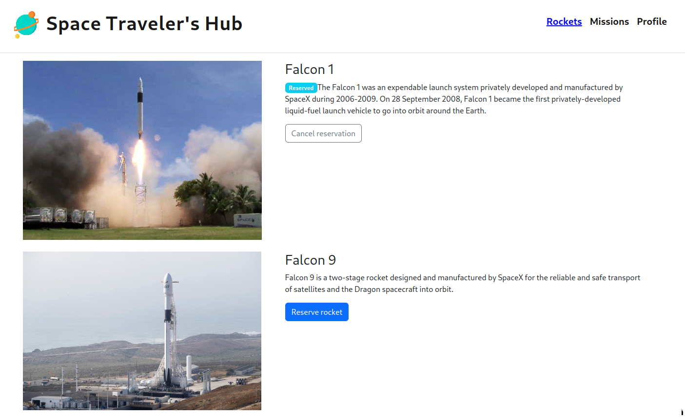

# Bookstore


> Space Traveler

The Space Travelers' Hub consists of Rockets, Missions, and the My Profile section.
It is a website that allows one to:

- Book a rocket.
- Join a Mission.
- Opt out of a mission.
- Unbook a rocket
## ScreenShort

## Built With

- React.Js
- CSS
- SpaceX  API

 ## Live Demo

[Live Demo Link]()

## Getting Started

To get a local copy up and running follow these simple example steps.

### Prerequisites

- NodeJS -(https://nodejs.org/en/)

### Setup

```bash
git clone https://github.com/GordonOtieno/space-t.git
cd ./space-t
```

### Install

```bash
npm install
```

### Usage

```bash
npm start
```

### Build

```bash
npm run build
```

### Run tests

```bash
npm test
```

## Author

👤 **Gordon Otieno**

- GitHub: [@Gordon_Otieno ](https://github.com/GordonOtieno)
- Twitter: [@GordonOtieno](https://twitter.com/gordonotieno)
- LinkedIn: [LinkedIn](https://www.linkedin.com/in/gordonotieno/)

## 🤝 Contributing

Contributions, issues, and feature requests are welcome!

Feel free to check the [issues page](https://github.com/GordonOtieno/space-t/issues).

## Show your support

Give a ⭐️ if you like this project!


## Acknowledgments

- Microverse
- [Developer of Apacexdata API](https://api.spacexdata.com/v3)

## 📝 License

This project is [MIT](./MIT.md) licensed.
